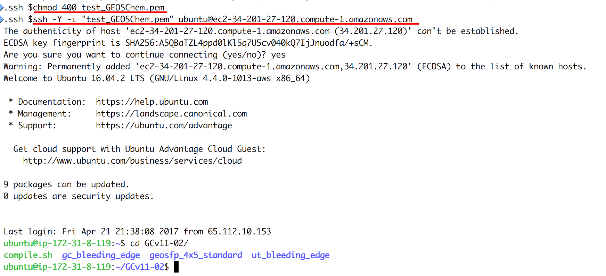

# Cloud-GC
## Running the GEOS-Chem CTM on cloud computing platforms

* Run GEOS-Chem without buying local machines -- get a virtual Linux server on the cloud in seconds 
* 1-month 4x5 standard chemistry simulation costs $1~2 -- no charge when you are not running the model
* No compilation error anymore-- all software and libraries are pre-installed

(All the other files in this repo are for myself to build cloud environments. Users only need to look at this page.)

## Tutorial
### Start a GEOS-Chem simulation within 10 minutes (and within 30 seconds for the next time)   -- all you need is the computer you are currently using, to connect to the cloud.

#### Step 1: sign up an Amazon Web Service(AWS) account
Go to  
http://aws.amazon.com   
Click on "sign in to the console".  
Then you should see:

After entering some basic information, you will be required to enter your credit card number:

Don't worry, this tutorial will only cost you $0.1 :)  

View the pricing at:  
https://aws.amazon.com/ec2/pricing/

If you are in academia, checkout the $100 credit for AWS cloud computing:  
https://aws.amazon.com/education/

Simply choose the basic plan when you encounter this page:

Now you should have an AWS account! It's time to run the model in cloud. 

(You can skip Step 1 for the next time, of course)

#### Step 2: launch a virtual server with GEOS-Chem installed 

Log in to AWS console, and click on **EC2**(Elastic Compute Cloud), which is the cloud computing platform. 
Other options are other services such as storage. You don't need to care about them at this time.

In the EC2 console, click on "AMI" (Amazon Machine Image) under "IMAGES" on the left of the page.

Select "Public images" and search for the AMI with GEOS-Chem installed. Select it and click on "Launch" 

**This one of the game-changing features of cloud computing.** An AMI means a copy of a specifc system. 
I started with a brand new Linux operating system, and built GEOS-Chem 
(and all the necessary software, of course) on it. 
After that, everyone is able to get a copy of my system, with everything installed correctly.

You have already specified your operating system, or the "software" side of the virtual server. 
Then it's time to specify the "hardware" side, mostly about CPUs.

In this toy example, choose "Memory optimized"-"r4.large" to test GEOS-Chem with the minimum fee.

There are many CPU options, including numbers and types. AWS free tier also gives you 750 free hours of "t2.micro", which
is the tiniest CPU. Its memory is too small to run GEOS-Chem, but it is good for testing library installation if you
need to.

 

For the first time of using EC2, you need to create and download a "KeyPair". 
This is equivalent to the password you enter to ssh to your local server. 
Here, such "password" is a file, being stored in your own computer. 
The only way to share your password with others is to share that file.

Use any name you like for that KeyPair, click on "Download Key Pair", and finally click on "Launch Instances".

(for the next time, you can simply select "Choose and existing Key Pair" and launch)

Within < 1min of initialization, "Instance State" should become "running":

Now your own server is running on the cloud!

#### Step 3: log in to the virtual server and run GEOS-Chem

Select your instance, click on the "Connect" button near the "Launch Instance Button", then you should see this page:

Copy the command below "Example:". Before using it to ssh to your server, you need to make some minor changes:

- cd to the directory that you store the Key Pair (preferably /.ssh)
- type "chmod 400 your\_key\_pair.pem" to change the permission.
- change "root" to "ubuntu". (You'll be asked to use "ubuntu" if you keep the "root")
- (optional) add -Y to allow x11 forwarding. 

Your terminal will look like this:

That's a system with GEOS-Chem already built!

**Trouble shooting: If you cannot ssh to it, the most likely cause is security 
configuration. Click on "Security Groups" in the EC2 Dashboard, set "Inbound" to "Anywhere" or "My IP"**

You can test the compiliation by executing  
$cd ~/GCv11-02  
$./compile.sh  

or just run the pre-compiled the model by   
$cd ~/GCv11-02/geosfp_4x5_standard  
$./geos  

You should get the same results as in those log files:  
[test\_compile.log](log/test_compile.log)  
[test\_run.log](log/test_run.log)  

Here we only test an 1-hour run to demonstrate the capability of running GEOS-Chem in cloud.
The "r4.large" instance type we chose has only a single core (so it is cheap), 
while its memory is large enough for GEOS-Chem to start.
To test longer runs, it is recommended to use "Compute Optimized" instance types with multiple cores such as "c4.4xlarge".

#### Step 4:**(Very important!) Always remember to shut down the instance when you finish the simulation!**

The lifetime of an "instance" is from launching to termination. 

## Advanced Usages 

#### Save your system's current status (e.g. all the files and software) so the information is not lost after termination

#### Use the "Spot Instance" to minimize the cost

https://aws.amazon.com/ec2/spot/spot-and-science/

 
============================================================
============================================================
 

## Future Plans and Possible Directions

#### Update GEOS-Chem source code and post-processing tools 

* Make the public release version of GEOS-Chem fully compatible with gfortran

The public release of v11-01 is now compatible with gfortran-5 but not gfortran-6. 

v11-02 (in development) works with gfortran-6.

gfortran is the key to make this entire thing possible. 
Unlike ifort, it is free and can be quickly installed on any systems.

* Replace IDL with python, which is free and open-source 

I've developed a python tool(https://bitbucket.org/gcst/gcpy) primarily for GCHP, but we will make it fully compatible with GEOS-Chem classic too.

It actually requires more change to the GEOS-Chem code than to the python code. 
Once GEOS-Chem can output all diagnostics in NetCDF format instead of in bpch format,
they can be very easily handled by any languages. This is expected to be finished in v11-02.

* (Long-term) Make GCHP run on the cloud.

GCHP is not compatible with gfortran now. Setting an MPI cluster on the cloud is also much tricker, although doable.

#### Design a strategy for long-term, economical workflow.

* Cheaper and more efficient data storage and sharing in cloud.

Currently I put all the input data under the root directory, 
which is convenient for illustration but bad for actual practice. 

Should make use of standalone *Amazon Elastic Block Store(EBS) volumes* and *Simple Storage Service (S3)* to store and share
data.

May also refer to this CESM work for how to manage the workflow: 
http://www.sciencedirect.com/science/article/pii/S0098300416304721

* How to handle unexpected shut-down for spot instances while still minimizing the cost?

Although there's only very little chance for spot instances to shut down, 
there should be a strategy to ensure the model runs safely.

#### Look at more cloud computing platforms and seek collaborations

Besides Amazon EC2, Google Compute Engine and Microsoft Azure also provide similar services.

Many of their services have one-to-one mappings to AWS:  
https://cloud.google.com/docs/compare/aws/compute  
https://docs.microsoft.com/en-us/azure/architecture/aws-professional/

* Possible to get some research grants from them?

For example, 
https://aws.amazon.com/research-credits/  
https://research.google.com/research-outreach.html#/research-outreach/faculty-engagement/faculty-research-awards/

#### Cooperate with other free, open-source community models like CESM and WRF?

* Something like cloud-computing-for-atmospheric-modeling-project?

Think of launching a virtual server with all commonly used models installed, and with all the input data available.
Less time on debugging, more time on science.

The biggest trouble for users seems to be building the NetCDF library. 
Almost all earth science models need NetCDF, so it would be an one-for-all work.

#### Provide friendly tutorials for more complicated scientific computing tasks

Most of the documents on AWS cloud computing are NOT for scientists. There are so many computer system jargons.
It's not like the GEOS-Chem wiki where you can often find useful solutions. 
That means, if you encounter any technical issues, you are likely to get more confused by looking through their documents.
That's the basic reason why I wrote this tutorial even though they already provide a huge amount of tutorials (for non-scientists) online. 

But that's not their fault.
Although cloud computing is getting popular among the scientific computing community, 
the majorities of the cloud platform users are still web developers and system engineers, not scientists.

*Scientific Computing in Cloud --  the Guide for Dummies* has yet to be written. 

## Additional resources

[1] *Cloud Computing in Ocean and Atmospheric Sciences[M]. Elsevier, 2016.* 
gives a nice overview of various cloud computing applications in our field.
It doesn't tell you how to actually do cloud computing, though.

[2] Review the (most basic) official AWS-EC2 tutorial:  
https://aws.amazon.com/getting-started/tutorials/launch-a-virtual-machine/  
The only difference from my tutorial is that you'll launch a brand new machine with nothing on it.
Other tutorials beyond this one has almost nothing to do with scientific computing.

[3] Consoles are excellent to start with. But as you become familiar with AWS, 
you might feel using the command line (https://aws.amazon.com/cli) is more efficient 
for managing your cloud servers.

Again, just like any other AWS documents, you are likely to see a lot of information 
that is totally unnecessary for a scientist to know, even for a computational scientist.

