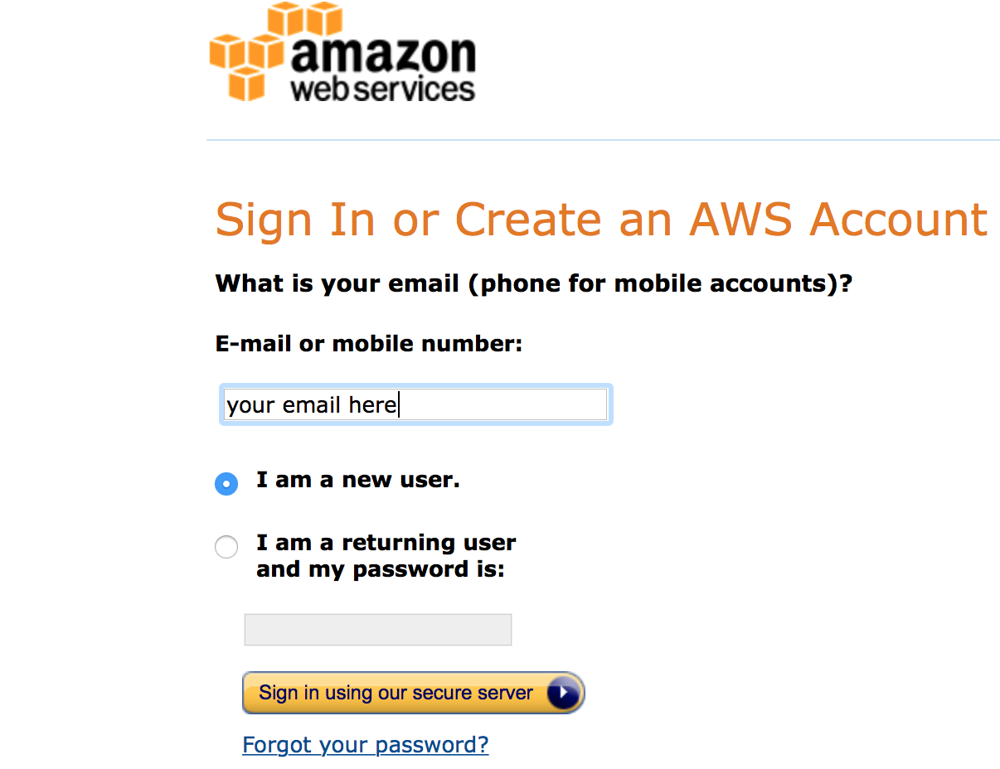

# Cloud-GC
## Running the GEOS-Chem CTM on cloud computing platforms

* Run GEOS-Chem without buying local machines -- get a virtual Linux server in the cloud in seconds 
* 1-month 4x5 standard chemistry simulation costs $1~2 -- no charge when you are not running the model
* No compilation error anymore-- all software and libraries are pre-installed

(All the other files in this repo are for myself to build cloud environments. Users only need to look at this page.)

## Tutorial
### Actually start a GEOS-Chem simulation within 10 minutes (and within 30 seconds for the next time)   -- all you need is the computer you are currently using, to connect to the cloud.

#### Step 1: sign up an AWS account
Go to  
http://aws.amazon.com   
Click on "sign in to the console".  
Then you should see:

After entering some basic information, you will be required to enter you credit card number:

Don't worry, this tutorial will only cost you $0.1 :)  

View the pricing at:  
https://aws.amazon.com/ec2/pricing/

If you are in academia, checkout the $100 credit for AWS cloud computing:  
https://aws.amazon.com/education/

Simply choose the basic plan when you encounter this page:

Now you should have an AWS account! It's time to run the model in the cloud.

#### Step 2: launch a virtual server with GEOS-Chem installed 

Log into AWS console, and click on **EC2**, which is the cloud computing platform. 
The other options are other services such as storage.
You don't need to care about them at this time.

In the EC2 console, click on "AMI" (Amazon Machine learning) under "IMAGES" in the left of the page.

Select the "Public images" and search for the AMI with GEOS-Chem installed. Select it and click on "Launch" 

This the game-changing feature of cloud computing. An AMI means a copy of a specifc system. 
I started with a brand new Linux operating system, and built GEOS-Chem 
(and all the necessary software, of course) on it. 
Then, everyone is able to get a copy of my system, with everything installed correctly.

You have chosen your "software"/"system", now it's time to choose the hardware, mostly about CPUs.
In this toy example, choose "Memory optimized"-"r4.large" to test GEOS-Chem with the minimum fee.

There are different numbers and types of CPUs to choose. The free tier  

 

For the first time of using EC2, you need to create and download a "KeyPair". 
This is equivalent to the password you enter to ssh to your local server. 
Here, such "password" is a file, being stored in your own computer. 
The only way to share your password to others is to share that file.

Use any name you like for that KeyPair - click on "Download Key Pair" - click on "Launch Instances"

Log in the run GEOS-Chem

**Always remember to shut down the instance when you finish the simulation**

## Advanced Skills 

### Use the "Spot Instance" to minimize the cost

## Future Plans ann Possible Directions

### Design a long-term, economical workflow.

* Strategy for cheaper and more efficient data storage and sharing in cloud.

* How to handle unexpected shut-down with spot instances while still minimizing the cost?

* May refer to the CESM work: http://www.sciencedirect.com/science/article/pii/S0098300416304721

### Provide friendly tutorials for more complicated scientific computing tasks

Most of the documents on AWS cloud computing are not for scientists. They are full of computer system jargons.
They are not like GEOS-Chem wiki where you can often find useful solutions. 
That means, if you encounter any technical issues, you are likely to get more confused by looking through their documents.
That's the basic reason why I wrote this tutorial. 

But that's not their fault.
Although cloud computing is getting popular among the scientific computing community, 
the majorities the cloud platform users are still web developers or system engineers, not scientists.

*Scientific Computing on Cloud --  the Guide for Dummies* has yet to be written. 

### Looking at more cloud computing platforms and seek collaborations

Besides Amazon EC2, Google Compute Engine and Microsoft Azure also provide similar services.

* Possible to get some research grants from them?

### Cooperate with other free, opensource community models like CESM and WRF?

* Something like cloud-computing-for-atmospheric-modeling-project?

The biggest trouble for users seems to be building the NetCDF library. 
Almost all earth science models need NetCDF, so it would be an one-for-all work.

