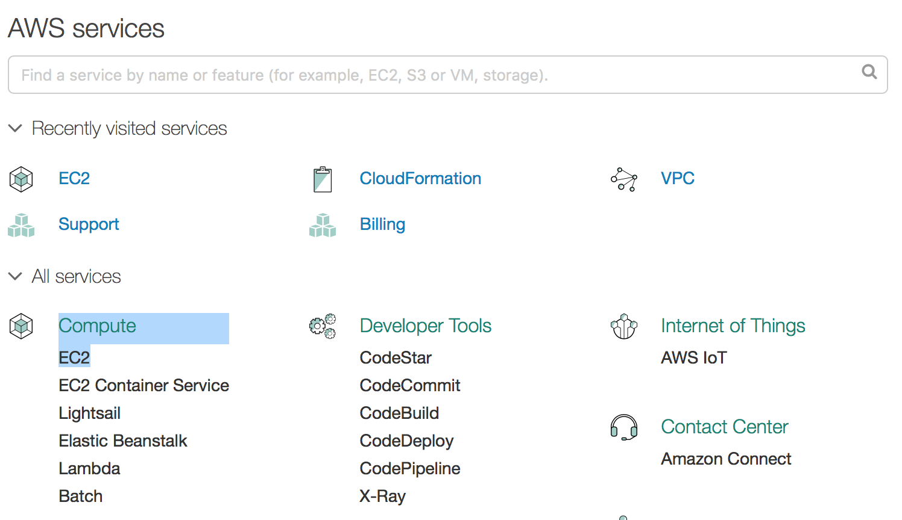
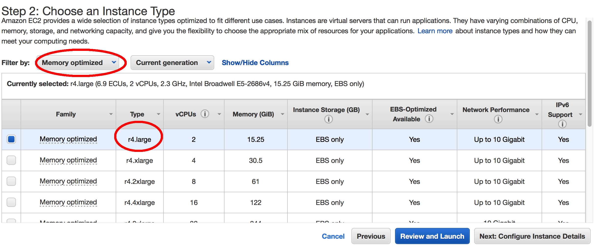

# Cloud-GC
## Running the GEOS-Chem CTM on cloud computing platforms

* Run GEOS-Chem without buying local machines -- get a virtual Linux server in the cloud in seconds 
* 1-month 4x5 standard chemistry simulation costs $1~2 -- no charge when you are not running the model.
* No compilation error anymore-- all software and libraries pre-installed

## Tutorial
### Actually start a GEOS-Chem simulation within 10 minutes.   All you need is the computer you are currently using.

#### Step 1: sign up an AWS account
Go to  
http://aws.amazon.com   
Click on "sign in to the console".  
Then you should see   

