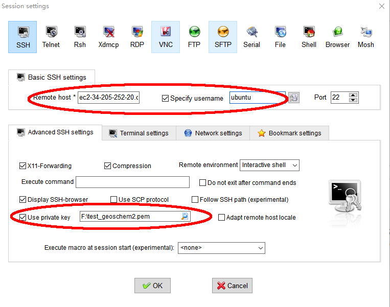

* For MobaXterm:

Split the ssh command into "Remote" and "username" boxes - 
Click on "Advanced SSH settings" - 
Click on "Use private key" - 
Choose the Key Pair you just downloaded.

* Another quick and dirty way is to log in to your local Linux server, 
transfer your keypair to that server, 
and then use the ssh command to further log in to your AWS instance.
